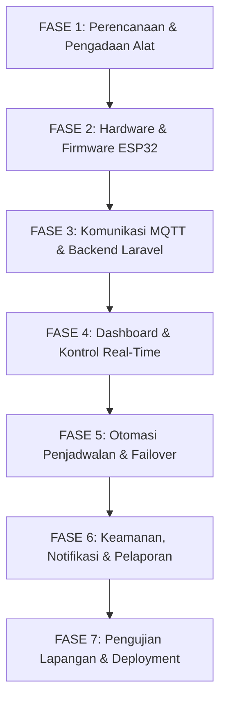

# 📋 ROADMAP & CHECKLIST PROYEK
## Sistem Monitoring & Penjadwalan Otomatis AC Ruang Server (PT PINDAD)

> **Status Dokumen:** Living Document / Progres Tracking  
> **Terakhir Diperbarui:** 18 Agustus 2026  
> **Platform & Stack:** ESP32 (C/C++ Arduino), EMQX MQTT Broker, Laravel 11, MySQL, Tailwind CSS, Chart.js  

---

## 📌 Ringkasan Status Proyek Saat Ini

| Komponen / Modul | Persentase Selesai | Status |
| :--- | :---: | :---: |
| **1. Desain Sistem & Kebutuhan Alat (BOM)** | **95%** | 🟢 Siap / Lengkap |
| **2. Firmware & IoT ESP32 (C++/Arduino)** | **80%** | 🟡 Fungsional Dasar Siap |
| **3. Hardware & Panel Assembly (Fisik)** | **50%** | 🟡 Tahap Perakitan Box Panel |
| **4. Backend API & MQTT Services (Laravel)** | **85%** | 🟢 Terhubung & Berfungsi |
| **5. Database & Logging Schema** | **90%** | 🟢 Tabel Logs & Schedules Terpasang |
| **6. Otomasi Penjadwalan (Scheduler Cron)** | **30%** | 🔴 Belum Ada Worker Otomatis |
| **7. Frontend Dashboard & Real-time Chart** | **90%** | 🟢 Tampilan Modern & Polling Live |
| **8. Autentikasi, Notifikasi & Laporan Ekspor** | **20%** | 🔴 Belum Diimplementasikan |

---

## 🗺️ Mapping Detail: Dari Mulai (Start) Hingga Target Akhir (Goals)

---

## 📝 CHECKLIST TAHAPAN PROYEK

### FASE 1: Perencanaan, Arsitektur & Pengadaan Komponen 📦
- [x] Identifikasi masalah beban panas dan pergantian AC di Ruang Server.
- [x] Penyusunan Bill of Materials (Daftar Kebutuhan Komponen).
- [x] Pembelian/Pengadaan modul IoT:
  - [x] ESP32 Development Board
  - [x] Modul RTC DS3231 (Real Time Clock)
  - [x] Sensor Arus ACS712 (2 unit untuk AC 1 & AC 2)
  - [x] Modul Relay Kontrol
  - [x] Kontaktor TeSys Schneider LC1D32M7
  - [x] Lampu Indikator Pilot Lamp Panel 220V (3 unit)
  - [x] Box Panel UK 25x35x12
  - [x] Power Supply Adaptor 5V 3A & Aksesoris Wiring
- [ ] Pengujian pembacaan presisi ADC tambahan (ADS1115 16-bit I2C) *(Opsional/Peningkatan presisi)*.

---

### FASE 2: Pengembangan Firmware ESP32 (IoT Edge) ⚡
- [x] Setup WiFi Station Mode & Auto-reconnect logic.
- [x] Integrasi komunikasi MQTT Client (PubSubClient) ke Public Broker (`broker.emqx.io:1883`).
- [x] Inisialisasi RTC DS3231 untuk pencatatan waktu offline / sinkronisasi.
- [x] Kalibrasi & rumus pembacaan arus AC (RMS) menggunakan ACS712.
- [x] Implementasi pengiriman telemetri periodik (Interval 30 detik) ke topik `pindad/ac/logs`.
- [x] Implementasi subscriber penerima perintah ON/OFF dari topik `pindad/ac/schedule`.
- [ ] **TODO Peningkatan Firmware:**
  - [ ] Logika Failover Lokal: Jika koneksi WiFi/MQTT putus, ESP32 tetap menjalankan jadwal pergantian AC berdasarkan jam internal RTC DS3231.
  - [ ] Implementasi filter noise ADC yang lebih adaptif agar tidak ada pembacaan arus hantu (ghost current).
  - [ ] Status *Heartbeat/Last Will and Testament (LWT)* agar server tahu seketika jika ESP32 mati lampu.

---

### FASE 3: Perakitan Fisik & Wiring Box Panel (Hardware) 🛠️
- [ ] Pemasangan DIN Rail & Komponen dalam Box Panel 25x35x12.
- [ ] Pengkabelan (Wiring) jalur daya tinggi 220V: MCB -> Kontaktor TeSys -> Stop Kontak AC 1 & AC 2.
- [ ] Pengkabelan jalur kontrol DC: ESP32 -> Relay -> Koil Kontaktor A1-A2.
- [ ] Pemasangan Lampu Pilot 22mm pada pintu panel (Indikator Power, AC 1 Aktif, AC 2 Aktif).
- [ ] Pemasangan sensor ACS712 pada kabel fasa beban masing-masing AC.
- [ ] Pengujian keamanan kelistrikan (grounding, isolasi kabel, uji beban nyata).

---

### FASE 4: Pengembangan Backend & Database (Laravel 11) 💻
- [x] Inisialisasi Project Laravel 11.
- [x] Konfigurasi Database MySQL (`ac_monitoring`).
- [x] Database Migrations:
  - [x] Tabel `ac_logs` (device_id, active_ac, current_ampere, recorded_at).
  - [x] Tabel `schedules` (label, start_time, end_time, is_active).
- [x] Pembuatan Model Eloquent: `AcLog`, `Schedule`, `User`.
- [x] Integrasi Library MQTT PHP (`php-mqtt/client`).
- [x] Service Publisher (`App\Services\MqttService`) untuk push perintah relay ke MQTT.
- [x] Background Daemon Worker (`php artisan mqtt:subscribe`) untuk mendengarkan data arus dan menyimpan ke MySQL secara kontinyu.
- [x] API Controller (`DashboardController`):
  - [x] Endpoint `GET /api/logs` untuk data real-time JSON.
  - [x] Endpoint `POST /ac/control` untuk trigger kontrol relay.
  - [x] CRUD endpoint penjadwalan.

---

### FASE 5: Otomasi Penjadwalan & Logika Pergantian AC (Smart Scheduler) ⏱️
- [x] Form CRUD input jadwal di Web UI.
- [x] Toggle aktif/nonaktif jadwal di database.
- [ ] **TODO Eksekusi Penjadwalan Otomatis (Background Job/Artisan Command):**
  - [ ] Buat Artisan Command: `php artisan ac:run-schedule` untuk mencocokkan waktu saat ini dengan daftar jadwal aktif di tabel `schedules`.
  - [ ] Otomatis kirim perintah MQTT `AC_1 ON / AC_2 OFF` (atau sebaliknya) saat jam transisi tiba.
  - [ ] Pasang di Laravel Scheduler (`routes/console.php` schedule every minute / Task Scheduler Windows).
  - [ ] Fitur proteksi interlock: jeda aman (safety delay misal 3-5 menit) sebelum AC pengganti dinyalakan / AC sebelumnya dimatikan agar kompresor awet.

---

### FASE 6: Frontend Dashboard & Modular UI/UX Architecture 📊
- [x] Desain Layout Premium bertema PT Pindad (Teal & Cyan, Outfit, Inter & JetBrains Mono typography).
- [x] Arsitektur Komponen Terisolasi & Berkelompok (`layouts/`, `modules/control/`, `modules/monitoring/`, `modules/schedule/`, `modules/logs/`).
- [x] Kartu status interaktif AC 1 (Lampu Panel Bawah) dan AC 2 (Lampu Panel Atas) dengan efek ambient glow & putaran turbin kipas dinamis saat aktif.
- [x] Switch toggle iOS dengan status label responsif & state locking (mencegah UI glitch saat polling).
- [x] Modul KPI Ringkasan: Total Beban Arus Gabungan, Estimasi Daya Watt @ 220V, Status Lokasi Server Room 1.
- [x] Polling otomatis data telemetri via AJAX setiap 3 detik dengan modular JavaScript.
- [x] Integrasi Chart.js bergradien halus untuk visualisasi tren arus listrik (Ampere).
- [x] Modul form jadwal dengan preset shift cepat (Shift Pagi, Sore, Malam) dan daftar jadwal responsif.
- [x] Modul live data table riwayat telemetri 10 pembacaan terakhir dengan kalkulasi Watt real-time.
- [x] Indikator status perangkat: ESP32 Online / Standby otomatis berdasarkan deteksi waktu pembacaan telemetri.
- [ ] **TODO Peningkatan Lanjutan:**
  - [ ] Filter rentang waktu grafik interaktif (1 Jam, 24 Jam, 7 Hari).
  - [ ] Halaman khusus arsip riwayat log penuh dengan paginasi & ekspor.

---

### FASE 7: Fitur Lanjutan (Security, Alerting & Reporting) 🚀
- [ ] **Autentikasi & Hak Akses:**
  - [ ] Halaman Login & Registrasi aman (Breeze / Form Auth).
  - [ ] Role Management: Admin (bisa ubah jadwal & kontrol manual) vs Viewer (hanya pantau).
- [ ] **Sistem Notifikasi & Alarm Anomali:**
  - [ ] Deteksi Trip/Kerusakan: AC berstatus ON tapi arus = 0A (indikasi MCB trip atau AC rusak).
  - [ ] Deteksi Overload: Arus melebihi batas aman (> misal 4.5A).
  - [ ] Notifikasi instan via Bot Telegram / WhatsApp / Email ke teknisi server.
- [ ] **Ekspor Laporan (Reporting):**
  - [ ] Download riwayat log ke format Excel (.xlsx) / PDF untuk kebutuhan laporan magang & operasional.
  - [ ] Perhitungan estimasi konsumsi daya harian (kWh = Volt x Ampere x Jam / 1000).

---

### FASE 8: Pengujian Sistem, Dokumentasi & Finalisasi 🎓
- [ ] Uji Integrasi End-to-End (Web -> MQTT Broker -> ESP32 -> Relay -> Kontaktor -> AC).
- [ ] Uji Ketahanan (Stress Test): Dijalankan continuous 24/7 di ruang server.
- [ ] Dokumentasi Teknis Proyek (Skematik Jalur Kabel, Wiring Diagram, Panduan Operasional).
- [ ] Penyusunan Laporan Akhir Magang / Skripsi.
- [ ] Presentasi dan Serah Terima Sistem ke Tim IT PT Pindad.

---

## 🎯 Target Akhir (Goals Proyek)

1. **Zero Downtime Ruang Server:** Suhu ruang server selalu stabil 24/7 berkat rotasi AC yang otomatis dan terpantau.
2. **Efisiensi & Umur Panjang Perangkat:** Mencegah satu AC bekerja non-stop terus-menerus melalui sistem penjadwalan bergantian yang seimbang.
3. **Visibilitas Penuh (Full Observability):** Teknisi dapat memantau kondisi dan arus listrik AC dari mana saja melalui dashboard web.
4. **Early Warning System:** Masalah kelistrikan / kompresor mati langsung terdeteksi seketika lewat anomali arus.
5. **Portofolio Magang Berkualitas Tinggi:** Sistem IoT industri lengkap dari rancang bangun hardware, firmware, cloud broker, hingga web dashboard enterprise.
